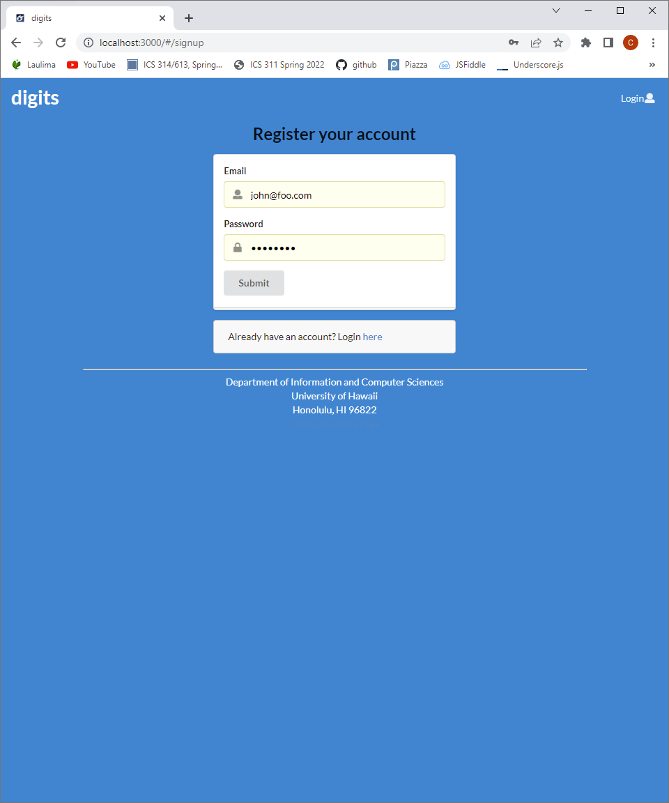
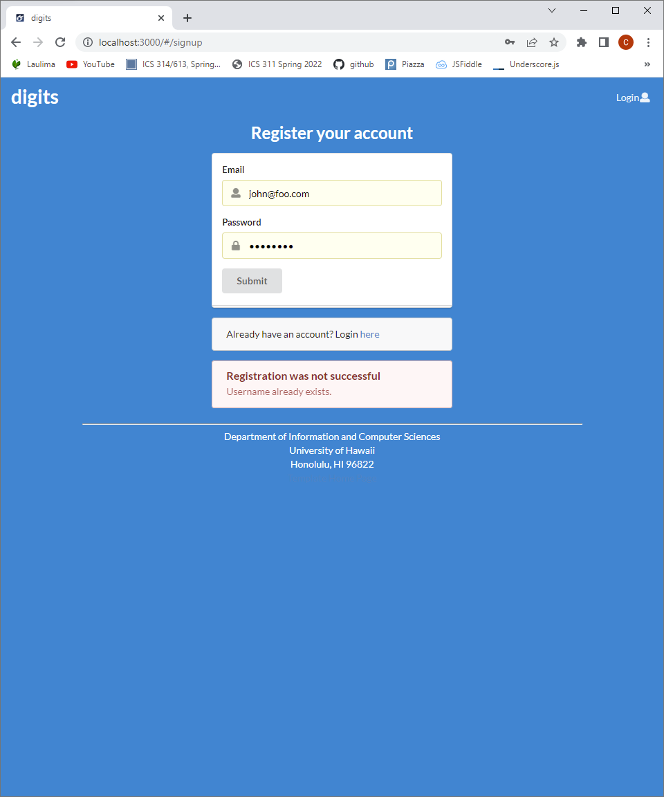
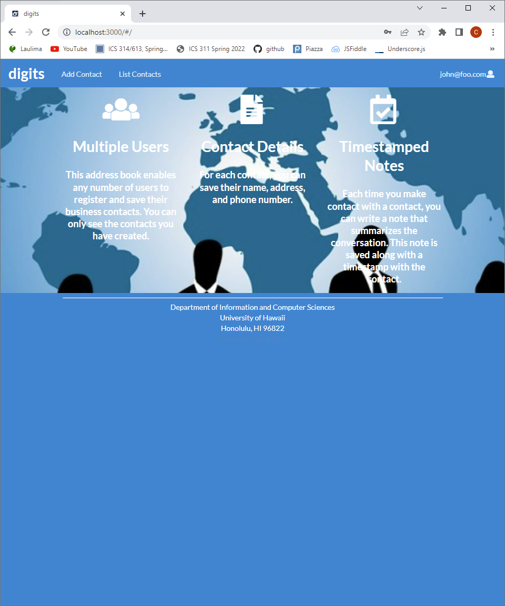
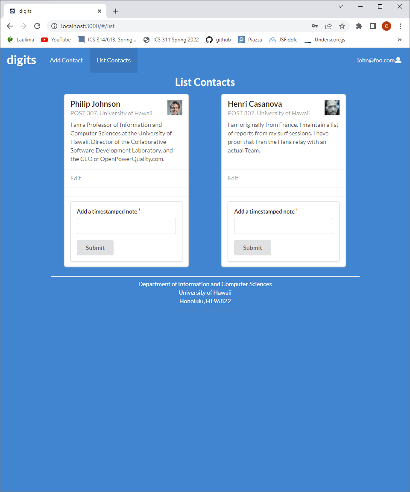

Digits is a web utility that creates user profiles that are able to store contact information.

## Installation

First, [install Meteor](https://www.meteor.com/install).

Second, go to [https://github.com/carakaki808/digits] and choose to use this template. Complete the directions to create a new repository that you own that is intiialized with this template's files.

Thirds, navigate to your newly created directory, and clone the repository to your local system. Best to use [GitHub Desktop](https://desktop.github.com/).

Fourth, cd into the app directory of the local repo for digits and install third party libraries with 

```
$ meteor npm install
```

## Running the system

Once libraries are installed, you can run the app by invoking the "start" script in the [package.json file]

```
$ meteor npm run start
```

When the app is run for the first time, it will create some default users.

View the app at [http://localhost:3000](http://localhost:3000).

You can login using the credintials in [settings.development.json](https://github.com/carakaki808/digits/blob/master/config/settings.development.json), or register a new account.

## Walkthrough

The following sections describe the pages you can access and their functions

#### Landing Page

When you first view the app at localhost:3000, you will be presened with the landing page. This page gives a brief description of the app's utilities as well as a link to sign-in/sign-up page.


#### Sign in/Account registration

The sign in and account registration are similar in appearance. The user may login with an existing email and password on the database. Alerts will go off if credentials don't match existing information. Otherwise the user may register for a new account that does not already exist on the database.





#### Post Login Landing Page

After successfully logging in, the nav bar will have two new options to the left, "Add Contact" and "List Contacts"



#### Add Contact Page

Allows user to save a contact profile that includes first & last name, address, an image, and a description.


#### List Contact Page

Allows user to list all contacts associated with the current user


